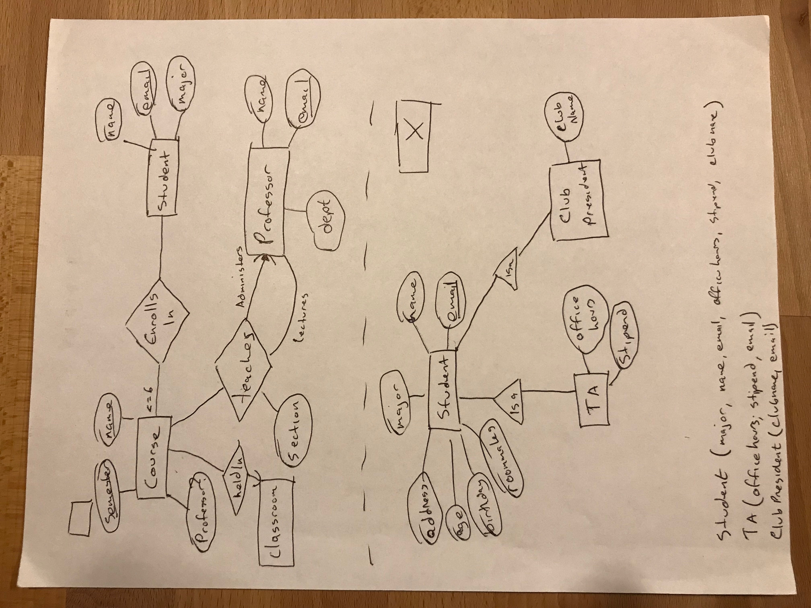
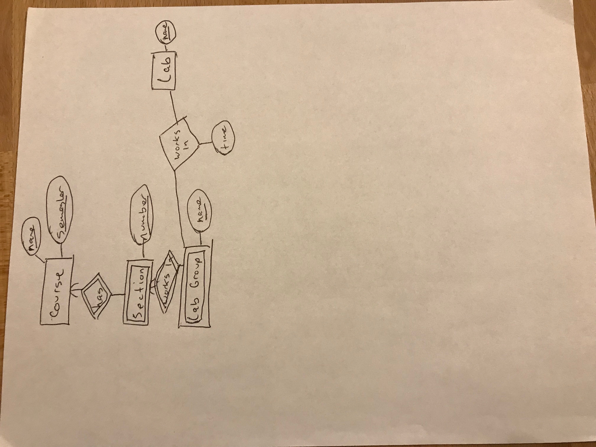

# Database Design

Consider the process used to design a database for an application

Begin with a design phase: answer questions related:
- What information will be stored
- How informational elements will be related to each other
- What constraints apply or will be assumed

A large majority of commercial database systems use the relational model

Should the design phase use this model as well?

No. In practice it's easier to start with a higher level model and convert later.

Main reason: the relational model captures only one concept: the relation. It's not always close to real-world scenarios

Several alternatives that are commonly used:
- Entity-Relationship model
- Unified Modeling Language 
- Object description language

Whatever approach is used, there are procedures for converting the higher-level design into a relational model, which can be run on a database. 

# Entity-Relationship Model

The structure of data is represented graphically in an "Entity Relationship Diagram"

3 principal element types:
- Entity Sets
- Attributes
- Relationships

## Entity Sets

An *entity* is an abstract object of some sort.

A collection of similar entities forms an *entity set*. 

An entity set is similar to the idea of a class or type in an object oriented language. However, the E-R model is static. We only care about the structure of the data, not operations on it. 

Example entity sets:

- Course
- Student
- Professor
- Classroom

## Attributes

Entity sets have associated *attributes* which are properties of the entities of that set

Note: different versions of the E/R model have different rules on what types of data can be an attribute
- We'll assume that attributes are primitives (strings, integers, boolean, etc)
- Other approaches might allow a struct-like structures 
- Or a set of values of some type, primitive or struct-like

## Relationships

*Relationships* are connections betwen two or more entity sets.

Example relationships:

- Taught-by
- Enrolls-in
- Located in

Binary relationships are the most common. However, E/R diagrams allows for multiway relationships

## Entity-Relationship diagrams

An E/R diagram is a graph representing entity sets, attributes, and relationships

Different shapes are used to represent each type:
- Rectangles for entity sets
- Ovals for attributes
- Diamonds for relationships

### Instances of an E/R Diagram

E/R diagrams are a notation for describing schemas of a database. We may imagine it containing an instance of the data, but that's just an abstraction. It's useful to imagine the database as if it existed.

For each entity set, the database will have a finite set of entities. Each entity has values for each of its attributes.

A relationship R that connects n entity sets: E1, E2, ..., En may be thought of as a set of tuples {e1, e2, ..., en} with values chosen from the entites in ei. These entities may be thought of as connected by the relationship.

This set of tuples is called a *relationship set.*

It can be helpful to visualize it as a table or relation, but the values of the tuples are other tuples, not atomic values. 

## Multiplicity of Binary E/R Relationships

In general a relationship can connect any number of entities from one member set, to any number of entities in another.

In practice, it's common for there to be a restriction on the "multiplicity" of the relationship. 

Suppose R is a relationship connecting entity sets E and F.
- If each entity in E can be connected to at most one entity of F, we say that R is a many-to-one relationship from E to F.
- If R is many-to-one from E to F, and many-to-one from F to E, we say that R is a one-to-one relationship.
- If R is neither many-to-one from E to F, or many-to-one from F to E, we say that R is many-to-many.

It's worth noting that a many-to-one relationship is a special case of many-to-many. So any property of a many-to-many relationship will also hold for a many-to-one.

Similarly, a one-to-one relationship is a special case of many-to-one...

We use arrows to denote the multiplicity of relationships. If a relationship is many-to-one from E to F, we show an arrow entering F.

Remember that an arrow means "at most one." It doesn't guarantee the presence of an entity in F. 

## Multiway Relationships

In the E/R relationship model, we can define relationships involving more than two entity sets.

"Ternary" or higher relationships are rare but are sometimes useful or necessary to model a real world scenario.

In multiway relationships, an arrow pointing to entity set E means that if we select one entity from each of the other entity sets in the relationship, those entities are related to at most one entity in E.

Think of a functional dependency: the other entities functionally determine E.

There are limits to what can be expressed using the arrow notation in multiway relationships.

## Roles in Relationships

It's possible for an entity set to appear multiple times in a given relationship

We denote this by drawing multiple lines

Each line to the entity set represents a different *role* the entity set plays in the relationship. We label each role.

## Attributes on Relationships

We can associate attributes with relationships, not just entity sets

## Converting multiway relationships to binary relationships

Some models don't support multiway relationships (UML and ODL, for example).

E/R model doesn't require binary relationships, but it's useful to be able to convert multiway relationships to binary relationships.

We introduce a new entity set: a "connecting entity set"

Think of its entities as tuples of the multiway relationship

Introduce new binary relationships between the connecting entity set and every entity set in the relationship.

## Subclasses in the E/R Model

Often, entities may contain certain properties that are not associated with all of the enties in the entity set.

We can form special-case entity set or *subclass*, with its own attributes and relationships.

We connect a subclass to its parent using a special relationship: "isa"

Every "isa" relationship is one-to-one

Because it's a special type of relationship, we denote it with a triangle instead of a diamond. 

A collection of "isa" relationships could have any structure. For this class, we'll limit ourselves to tree structures with a common root. 

Given a tree structure, any given entity is made up of *components* from the entity sets in the subtree, including the root.

# Design Principles

Some principles of a good data model design:

### Faithfulness

The design needs to be faithful to the specifications of the application. Entity sets and their attributes should reflect reality. 

Whatever relationships we assert should reflect what we know about reality.

### Avoid Redundancy

We should be careful to say everything only once

We've discussed problems raised by anomalies

E/R model gives us new ways to introduce redundancy

### Simplicity Counts

Avoid introducing more elements into your design than is absolutely necessary

### Choose the right relationships

We have a number of ways to connect entity sets. Adding every possible relationship generally doesn't help. 

- Several relationships might reflect the same information
- One relationship might be derived from the others

### Pick the right kind of element

Often have a choice between attributes and Entity-set/Relationship to model a concept. 

Making everything an attribute can often lead to trouble

When can we replace some entity set E with attributes of other entity sets?

If E follows several conditions, it can be replaced:
- All of the relationships involving E have arrows entering E
    - E must be the "one" in any many-to-one relationships
- If E has more than attribute, then no one attribute depends on the others
    - The only key for E is all of attributes
- No relationship involves E more than once

If the conditions are met, we replace E as follows:
- If there is a many-to-one relationship R from entity set F to E, remove R, make attributes of E (and R) into attributes of F, renaming as needed
- If there is a multiway relationship R with an arrow to E, delete the arc from R to E, and move the attributes of E to R.

## Constraints in the E/R Model

There are several ways of expressing the concept of constraints:
- There's a way to express the idea of a key
- We've seen how we can use arrows in a relationship as a kind of functional dependency
- There's also a way to express referential integrity constraints

### Keys in the E/R Model

A key for an entity set E is a set of a one or more attributes K, such that two distinct entities can have the same values for all of the attributes in K.

Things to remember:
- Every entity set must have a key. In some cases ("isa" hierarchies, and weak-entity sets), the key or parts of the key, may reside on another entity set. 
- There can be more than one possible key. It's customary to pick one and act as if it were the only key. 
- When an entity set is involved in an "isa" relationship, we require that the root entity set have all the attributes for the key

Just like the relational model, we denote the key by underlining the attributes

### Referential Integrity

A Constraint that states that information appearing in one context must also appear in another related context.

We use a rounded arrow to denote that a relationship is not only many-to-one, but that a value is required to exist.

### Degree Constraints

We can attach a bounding number to the edges that connect a relationship and an entity set.

## Weak Entity Sets

It's possible for an entity set to be composed of attibutes, some or all of which belong to another entity set

This is called a *weak entity set*

Two main causes of weak entity sets
- Sometimes, things fall into hierarchies unrelated to "isa" relationships. 
- Elimination of multiway relationship, the connecting entity sets will cause a weak entity

### Requirements for weak entity sets

The key for weak entity set W consists of:
- Zero or more attributes of its own, and
- One or more attributes from entity sets that are connected by certain types of many-to-one relationships, called *supporting relationships*

In order for many-to-one relationship R from E to F to be a supporting relationship for E, the following must be true:
- R must be a binary, many-to-one relationship from E to F
- R must have referential integrity from E to F (uses the rounded arrow)
- The attributes that F supplies to E must be key attributes of F.
    - Another entity set G, which is a supporting entity set of F, might supply key attributes, and so on 
    
### Notation

If an entity set is weak, its border will be doubled

Its supporting relationships have double borders.

If it supplies any attributes of its key, they are underlined.

Note that the double-border diamond is only used for the supporting relationships. A weak entity set may participate in other relationships that aren't supporting.

## Converting from E/R Diagrams to relational models

Basics are straightforward:
- Turn each entity set into a relation with the same set of attributes
- Replace a relationship by a relation whose attributes are the keys for the connected entity sets.

Special cases:
- Weak entity sets
- "Isa" relationships
- Sometimes we may want to combine two created relations, particularly the relations created from a relationship and connected entity set

Converting a non-weak entity set is easy. Create a relation with the same name and set of attributes.

Converting relationships: the relation created will have the following attributes:
- The attributes of the relation
- The key attributes of any connected entity sets

If an entity set appears multiple times in different roles, then its key attributes must appear once for each role. They must be renamed to avoid ambiguity. 

### Combining relations

Sometimes, the relations we get by converting an entity set and relationships are not the best possible relations for the given data. 

A common example occurs when there is an entity set E with a many-to-one relationship R to another entity set F

The relations E and R will both have the key for E in their schema. 

E will also have its own attributes

R will have its own attributes, plus the key attributes of F

Because R is many-to-one, all the attributes are functionally determined by the key of E.

We combine E and R into one relation containing:
- All the attributes of E
- The key attributes of F
- Any attributes of R

Whether to combine is a matter of judgment. 

### Handling Weak Entity Sets

We do three things differently:
- The relation for W must include not only the attributes of W, but the key attributes of any supporting entity sets.
- The relation for any relationship involving W must use all the key attributes for W, not just those appearing in W itself
- A supporting relationship for W doesn't need to be converted. Its attributes can be added to the relation for W.

### Converting Subclass structures to relations

There are three approaches for converting "isa" relationships
- Follow the E/R viewpoint: create relations for every entity set in the hierarchy, using key attributes from the root as necessary
- Treat entities as objects belonging to a single class. For each possible subtree that includes the root, create a relation whose schema includes all the attributes of the subtree
- Use null values: create one relation combining all the attributes of all entity sets in the hierarchy. Each tuple will have null values for attributes that do not apply
