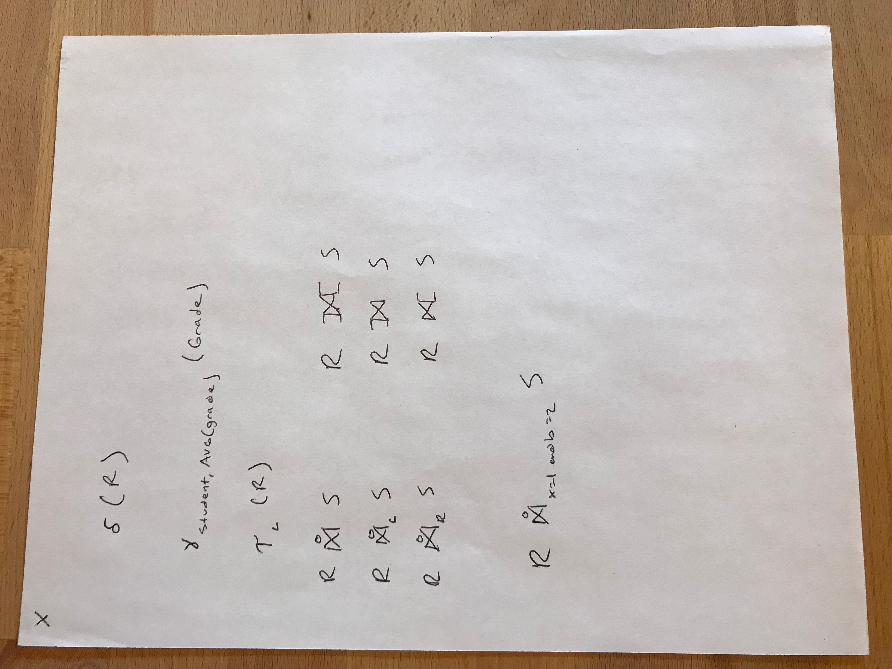

# Algebraic and Logical Query Languages

Start by applying relational algebra to *bags*.

Bags (multisets) are similar to sets but allow duplicates.

Why Bags?

Most commercials DBMS implement relations as bags, rather than sets.

Some relational operators are considerably more efficient using the bag model

Example: Union, projection

There are also where a correct answer cannot be obtained using sets.

Example: computing the average a column:

We'd take the projection first, then remove duplicates, after which the computed average is incorrect

## Set Operations on Bags

Suppose R and S are relations where tuple t appears n times in R and m times in S

In bag union, t appears n + m times

In bag intersection, t appears min(n, m) times

In bag difference (R − S), t appears max(0, n - m) times

``` 
R       S
---     ---
1       1
2       1
2       2
3       2  
4       2
        3
        
        
R − S
------
4


S − R
-----
1
2


```

## Project of Bags

Project each tuple. Duplicates are allowed, so nothing else needs to be done

``` 
R
A   B 
------
1   2
1   3
1   4
2   4


π A (R) (with sets)
------
1
2

π A (R) (with bags)
------
1
1
1
2

```

## Selection of Bags

Apply the selection criteria to each tuple individually. Since duplicates are allowed, no more needs to be done.

``` 
R
A   B 
------
1   2
1   3
1   3
1   4
2   4
```

## Product of Bags 

R × S

Pair each tuple of R with each tuple of S

If a tuple r appears n times in R, and a tuple s appears m times in S, then the tuple rs appears nm times

## Joins of Bags 

R ⨝ S

We compare each tuple of R to each tuple of S, and if they join, we add them to the result.

Note that each instance of a duplicate tuple will join

## Extending operators for Relational Algebra

We'll add some additional operators, applicable bags, commonly implemented by SQL

### Duplicate elimination 

Exactly as it sounds.

### Aggregation operators

Operators that apply to sets/bags of number or strings. Used to "aggregate" the values in one column of a relation.

- SUM
- AVG
- MIN
- MAX 
- COUNT 

### Grouping

We don't always want to aggregate an entire column. We need to be able to consider a relation in groups, and then aggregate within groups.

Example: Grades(student, course, semester, grade)

Grouping operator: g L (R)

L is a list of elements, each of which is either:
- An attribute of R (called a *grouping attribute*)
- An aggregation operator, applied to an attribute of R
    - Includes a new name for the result
    - called an *aggregated attribute*

To construct g L (R):

1. Partition R into groups, where each groups consists of tuples that agree on all of the grouping attributes
2. For each group, produce a single tuple that has:
    - the shared values for the grouping attributes for the group
    - Aggregations, over the group, for aggregated attributes
    
Note that duplicate elimination is a special case of grouping

### Extended Projection Operator

Previously π L (R) where L was a list of attributes

We'll extend it so that elements of L can be:
- A single attribute of R
- Expressions X -> Y, where X and Y are names for attributes
- Expressions E -> Z, where E is an expression involving:
    - attributes of R
    - Constants
    - Arithmetic operations
    - string operations
    And Z is a name for the result of E

We compute the result by considering each tuple in turn.

Each tuple of R will provide one tuple in the result.

Duplicates in R are considered multiple times

The result can have duplicates, even if R does not

```  
R
a   b   c
---------
1   1   1
1   2   3
2   2   3

π a, b * 2, c -> d (R)

a, b*2, d
---------
1   2   1
1   4   3
2   4   3

π b % 2 (R)


π a, b * 2 -> bb , c * a / b -> f (R)

a   bb  f
------------
1   2   1


```


### Sorting Operator 
 
Sort L (R) 

L is a list of attributes: A1, A2, ..., An

Sort R by A1, ties are broken by A2, and so on 


### Outer Joins

It's possible for tuples to be "dangling:" they didn't join with anything

As dangling tuples aren't included in the result, the join may not have complete information.

R OuterJoin S starts with R ⨝ S, and adds all tuples that didn't join

Dangling 


``` 
R           S
a   b       b   c
------      ------
1   2       2   3
1   3       4   4
2   3

R OuterJoin S
a   b   c
----------
1   2   3
1   3   null
2   3   null
null4   4


```

There are several variants:
- OuterJoin (sometimes Full OuterJoin)
- LeftJoin (only includes dangling tuples from the first relation)
- RightJoin (only includes dangling tuples from the second relation)

All three also have theta-join variants



# Logic for Relations

We can use logic to build queries, rather than relational algebra

Query language, Datalog consists of if-then rules

Subset of the Prolog

Implementations in a number of other languages

Declarative, not procedural

## Predicates and Atoms

Relations in Datalog are represented by Predicates 

Each predicate takes a fixed number of arguments and returns a boolean value

A predicate followed by its arguments is called an *atom*

Think of a predicate as a function that returns a boolean value

If relation R has n attributes in some order, we use R as the name of a predicate

R(a1, a2, ..., an) is TRUE if (a1, a2, ..., an) is tuple in R

Assume for now that relations are sets

There are approaches to working with bags in datalog, but in general datalog with sets

Example:


``` 
R
A   B 
------
1   2
3   4

R(1, 2) is True
R(3, 4) is True

R(x, y) is False for any other values
``` 

### Arithmetic Atoms

An arithmetic atom is a comparison between two arithmetic expressions (e.g., x < y)

Arithmetic atoms in contrast to Relational Atoms

Note that both atoms take as arguments the variables that appear and return boolean values

Think of arithmetic atoms as relations that contain all true tuples

x < y contains all possible values (x, y) where the condition is true

## Datalog Rules and Queries

A datalog rule consists of:
1. A relational atom called the *head* followed by
2. the symbol <-, often read as "if," followed by
3. A *body* consisting of one or more atoms, called *subgoals*, which may be either relational or arithmetic
    - Subgoals are connected by AND or OR
    - May be optionally preceded by NOT
    
Example:

Course(name, semester, location, time, capacity)

BigCourse(name, semester) <- Course(name, semester, location, time, capacity) AND capacity >= 100

We can optionally use the _ character instead of naming every variable for cases where the value doesn't matter

BigCourse(name, semester) <- Course(name, semester, _, _, capacity) AND capacity >= 100

A *query* in datalog is one or more rules

## Meaning of Datalog Rules

Imagine the variables of the rule ranging over all possible values

Whenever those value together make the subgoals true, we see what values are in the head, and add that to our result set

There are some restrictions: we need the result to be a finite relation, and we want the arithmetic subgoals and negated relational subgoals to make intuitive sense 

We apply a *safety condition*:
- Every variable that appears anywhere in the rule, must appear in some non-negated relational subgoal in the body


Example:

P(x, y) <- Q(x, z) AND NOT R(w, x, z) AND x < y

has three violations


There's another way to think about the meaning of rules:

Rather than consider every possible value, we consider every possible combination of sets of tuples existing in non-negated relational subgoals

If some assignment (combination) is consistent (it assigns the same values to each variable), then we consider whether it's true, if so we look at what was assigned in the head, and add it to the result.


Teaching(professor, course, semester) <- Course(name, semester, _, _, _) AND ProfessorAssignment(professorName, courseName, semester) AND courseName == name

### Datalog with Bags

As long as there are no negated relational subgoals, we apply Datalog rules to Bags as well.

Conceptually simpler to use the second approach above


R(a, b, c) <- S(a, b) AND c = a (not safe)

−
∪
∩
σ
π
×
⨝ 
θ
ρ
⊆
∅